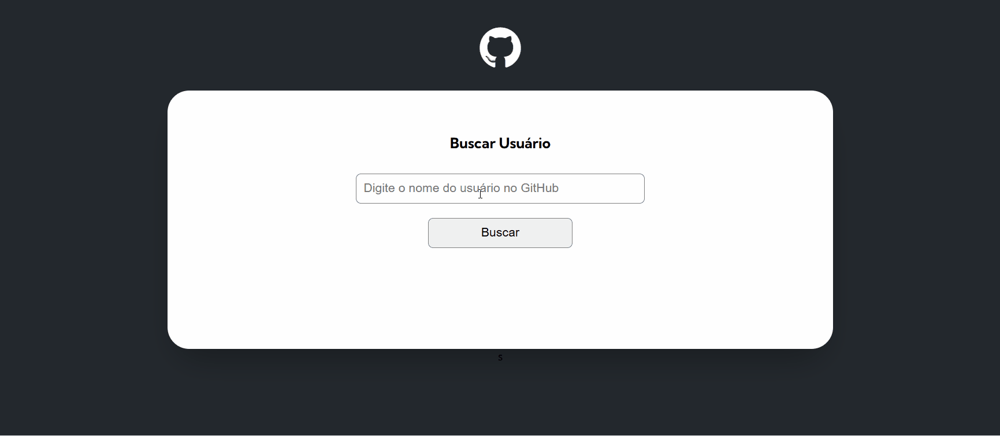

<h1>GitHub API User Finder</h1>

Um projeto que utiliza a API do GitHub para buscar informações de usuários, seus repositórios e eventos, renderizando-os de maneira visual e interativa.

 <h2>📑 Índice</h2>
    <ol>
        <li><a href="#descricao">Descrição</a></li>
        <li><a href="#estrutura">Estrutura do Projeto</a></li>
        <li><a href="#tecnologias">Tecnologias Utilizadas</a></li>
        <li><a href="#execucao">Como Executar o Projeto</a></li>
        <li><a href="#funcionalidades">Funcionalidades</a></li>
        <li><a href="#estrutura-codigo">Estrutura de Código</a></li>
        <li><a href="#captura-tela">Captura de Tela</a></li>
        <li><a href="#melhorias">Melhorias Futuras</a></li>
        <li><a href="#agradecimentos">Agradecimentos</a></li>
        <li><a href="#licenca">Licença</a></li>
    </ol>
    
<h2>📋 Descrição</h2>

O projeto faz uso do <strong>fetch API</strong> para realizar requisições à API do GitHub, exibindo dados do perfil do usuário, como:

<ul>
        <li>Nome</li>
        <li>Biografia</li>
        <li>Seguidores e seguidos</li>
        <li>Repositórios (com forks, estrelas, watchers e linguagem de programação)</li>
        <li>Eventos recentes (como <code>CreateEvent</code> e <code>PushEvent</code>)</li>
    </ul>
    
 <h2>📂 Estrutura do Projeto</h2>
    <pre>
    .
    ├── index.html
    ├── src
    │   ├── css
    │   │   ├── reset.css
    │   │   ├── styles.css
    │   ├── api-github
    │   │   ├── variables.js
    │   │   ├── user.js
    │   │   ├── repositories.js
    │   │   ├── events.js
    │   ├── objects
    │   │   ├── user.js
    │   │   ├── screen.js
    │   ├── index.js
    </pre>

<h2>🔧 Tecnologias Utilizadas</h2>
<ul>
        <li>HTML5</li>
        <li>CSS3</li>
        <li>JavaScript (ES6+)</li>
        <li>API do GitHub</li>
</ul>
    
<h2>🚀 Como Executar o Projeto</h2>
<ol>
        <li>Clone o repositório:</li>
        <pre><code>git clone https://github.com/seu-usuario/seu-repositorio.git</code></pre>
        <li>Abra o arquivo <code>index.html</code> em um navegador ou use uma extensão como o Live Server para melhor experiência.</li>
</ol>
    
<h2>📜 Funcionalidades</h2>
<ul>
        <li>Busca de informações básicas de qualquer usuário do GitHub.</li>
        <li>Listagem dos repositórios públicos do usuário.</li>
        <li>Exibição dos eventos recentes de criação e push do usuário.</li>
        <li>Interface responsiva e estilizada.</li>
 </ul>

<h2>📘 Estrutura de Código</h2>
 <h3>1. <code>variables.js</code></h3>
 
Define a URL base e os limites de resultados da API.

    
<h3>2. <code>services/*.js</code></h3>

Inclui métodos para consumir os dados da API do GitHub:

<ul>
    <li><code>getUser(userName)</code> - Obtém informações básicas do usuário.</li>
     <li><code>getRepositories(userName)</code> - Obtém os repositórios do usuário.</li>
     <li><code>getEvents(userName)</code> - Obtém eventos recentes do usuário.</li>
</ul>

<h3>3. <code>objects/user.js</code></h3>
    
Um objeto para armazenar e manipular dados do usuário.

<h3>4. <code>objects/screen.js</code></h3>
    
Responsável por renderizar os dados do usuário e lidar com a interface do usuário.

  <h2 id="captura-tela">🖼️ Captura de Tela</h2>
    
Abaixo está uma captura de tela da aplicação em execução:

    
<h2>💡 Melhorias Futuras</h2>
    <ul>
        <li>Paginação para exibir mais repositórios e eventos.</li>
        <li>Adição de gráficos para representar dados do usuário.</li>
        <li>Suporte para temas escuro e claro.</li>
    </ul>
<h2 id="agradecimentos">🙏 Agradecimentos</h2>
    
Agradeço a todos que contribuíram direta ou indiretamente para este projeto, com destaque para as documentações disponíveis e as ferramentas open-source que tornam o desenvolvimento possível.Um agradecimento especial ao <strong>Dev Quest</strong> por me proporcionar um aprendizado ímpar! 
    
 <h2>🤝 Contribuição</h2>
    
Sinta-se à vontade para contribuir com melhorias no projeto. Basta abrir um <strong>pull request</strong> ou relatar problemas na aba de <strong>issues</strong>.

<h2>📝 Licença</h2>
    
Este projeto está licenciado sob a <strong>MIT License</strong>.

